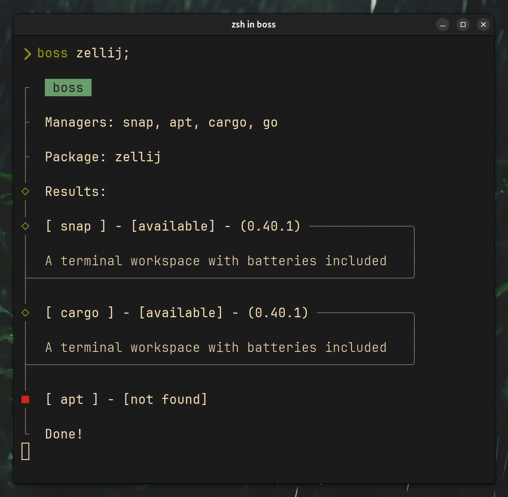

# boss

_The boss of package management._

## Features
### Currently
- checks all available package managers for a given package:
  - if its **installed**,
  - if not, if its **available to download** with a manager.
- shows descriptions for available packages
- shows the **latest version** of the package
- shows the **installed version** of the package
- quiet flag to only return with 0 or 1

### Planned
- check for similar package names (like `pkg-cli`, `pkg-git`, `pkg-bin`, `pkg-2`)
- preferences (sorting of order of managers)
- outputs:
  - pretty cliclack
  - plain (dont use cliclack for output but plain text or markdown)
- read files instead of calling commands when possible
- check mutiple packages at once
- continue with a prompt what to do (install, update, etc.)
- multithreading or async

> (also see the [todo mindmap](todo.hmm))

---

## Support
### Currently
#### General
- snap
- apt
- yay (old code)

#### Language specific
- cargo
- go (disabled for now)

### Planned
#### General
- flatpak
- brew?
- pacman (if yay is not installed)
- paru (if yay is not installed)
- dnf?
- rpm?
- zypper?
- nix?

#### Language specific
- npm
- yarn?
- pip
- pypi?
- pipx?
- conda?
- gem?

---

## Details
- uses rust because of string processing capabilities and safety
- uses cliclack for the pretty structured output
- uses strp for parsing the command outputs
- calls shell commands (for now)
- works on Linux
- might work on macOS (will test with darling soon)
- won't work on Windows (also not planned to do so...)
