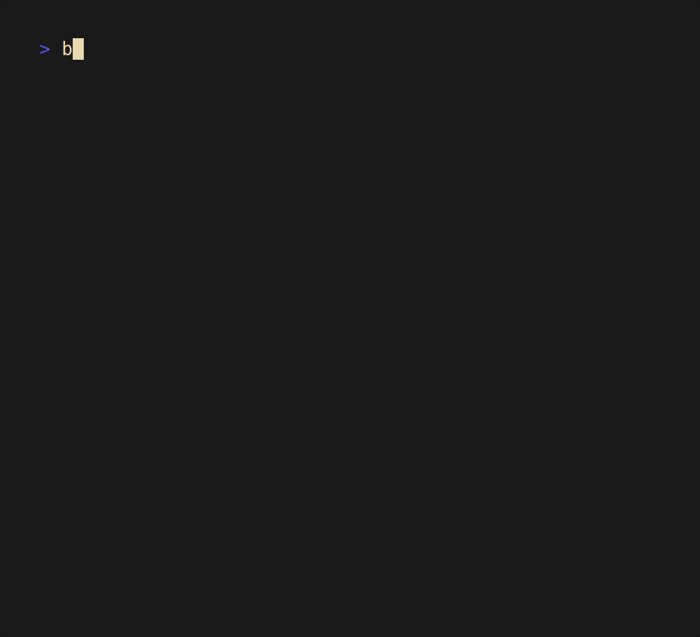
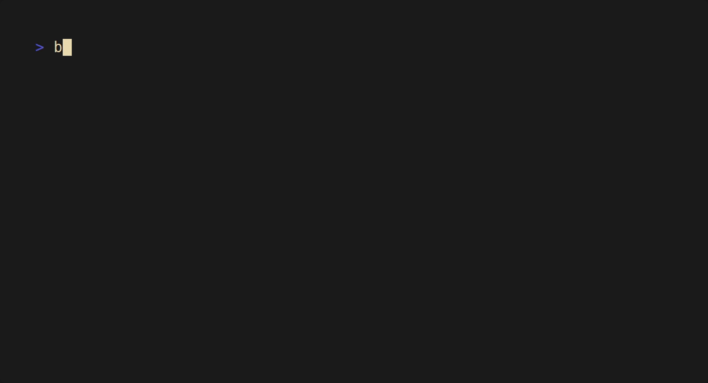
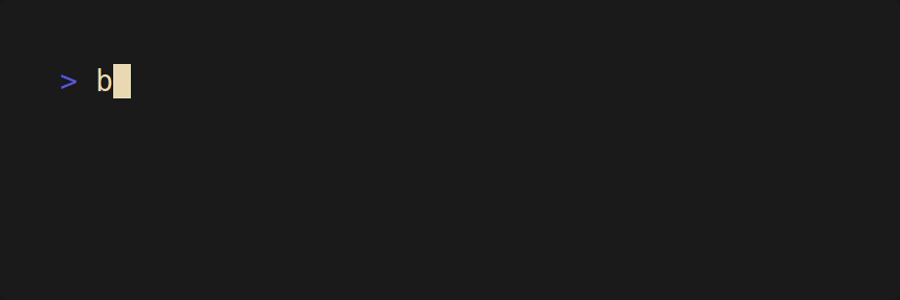

# boss

<div align="center">
  
  <br>
  <a href="https://github.com/NQMVD/boss?tab=readme-ov-file#details">
	  
  <a/>
  <a href="https://github.com/NQMVD/boss?tab=readme-ov-file#support">
  	
	</a>
  <a href="https://just.systems">
    
  </a>
  <br>
  <i>The boss of package management.</i>
</div>


## Showcase
<details>
  <summary>open sesame</summary>

  ## helix query
  

  ## helix query --interactive
  

  ## shows latest version and installed version
  

  ## stays quiet for scripts
  
</details>

## Features
### Currently
- checks all available package managers for a given package:
  - if its **installed**,
  - if not, if its **available to download** with a manager.
- shows descriptions for available packages
- shows the **latest version** of the package
- shows the **installed version** of the package
- quiet flag to only return with 0 or 1
- interative flag to ask for user input

### Planned
- check for similar package names (like `pkg-cli`, `pkg-git`, `pkg-bin`, `pkg-2`)
- preferences (sorting of order of managers)
- outputs:
  - pretty cliclack
  - plain (dont use cliclack for output but plain text or markdown)
  - table (use nu)
- read files instead of calling commands when possible
- check mutiple packages at once
- continue with a prompt what to do (install, update, etc.)
- config file
- more checks (validate location, sourced in path, etc.)
- multithreading or async

> theres also a plan for taking inspiration from topgrade on how to work with different managers.
> (also see the [todo mindmap](todo.hmm) for details)


## Support
### Currently
#### General
- snap
- apt
- yay (old code)

#### Language specific
- cargo
- go (disabled for now)

### Planned
#### General
- flatpak
- brew?
- pacman (if yay is not installed)
- paru (if yay is not installed)
- dnf?
- rpm?
- zypper?
- nix?

#### Language specific
- npm
- yarn?
- pip
- pypi?
- pipx?
- gem?

## Installation
### From source (via cargo and git)
```bash
cargo install --git https://github.com/NQMVD/boss.git
```

### From source (clone with gh + just)
```bash
gh repo clone NQMVD/boss
cd boss
just install
```

### From source
```bash
git clone https://github.com/NQMVD/boss
cd boss
cargo build --release
sudo mv target/release/boss /usr/local/bin
```

> binaries will be included at some point

## Update
### From source (pure bash)
```bash
git pull
cargo build --release
sudo mv target/release/boss /usr/local/bin
```

### From source (just)
```bash
just update
```


## Details
- uses rust because of string processing capabilities and safety
- uses cliclack for the pretty structured output
- uses strp for parsing the command outputs
- calls shell commands
- works on Linux
- might work on macOS (will test with darling soon)
- won't work on Windows (also not planned to do so...)
